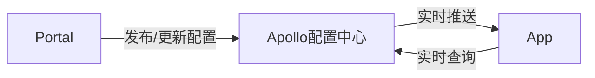

<!--
 * @version: 1.0.0
 * @Date: 2019-06-21 17:07:09
 * @LastEditTime: 2019-09-26 20:51:25
 -->
# [配置文档](https://docsify.js.org/#/zh-cn/quickstart)

<!-- !>  **{{msg}}** 。 -->
<vuep template="#example"></vuep>

  <script v-pre type="text/x-template" id="example">
  <template>
    <div>{{msg}}</div>
  </template>

  <script>
    module.exports = {
      data() {
        return {
          msg: '使用命令docsify serve docs初始化该文档'
        }
      }
    }
  </script>
</script>

#### markdown部分测试

?> 普通提示

[忽略编译链接](/_page/config/config.md ':ignore')

[设置链接的 target 属性](/_page/config/config.md ':target=_blank')

表头|表头|表头
---|:--:|---:
内容|内容|内容
内容|内容|内容

```
  代码...
  代码...
  代码...
```

- [ ] foo
- bar
- [x] baz
- [] bam <~ not working
  - [ ] bim
  - [ ] lim

<!-- tabs:start -->
#### ** demo1 **
内容1
#### ** demo2 **
内容2
#### ** demo3 **
内容3
<!-- tabs:end -->

[mermaid实例](https://www.cnblogs.com/nanqiang/p/8244309.html)



<!-- <script>
  new Vue({
    el: '#main',
    data: { msg: '使用命令docsify serve docs初始化该文档' }
  })
</script> -->
