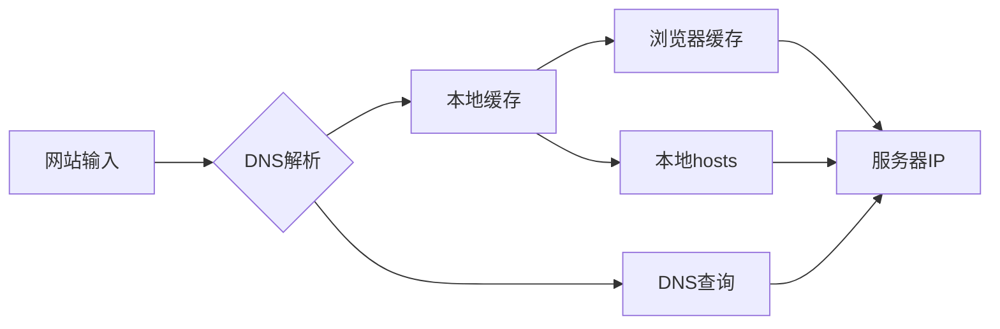
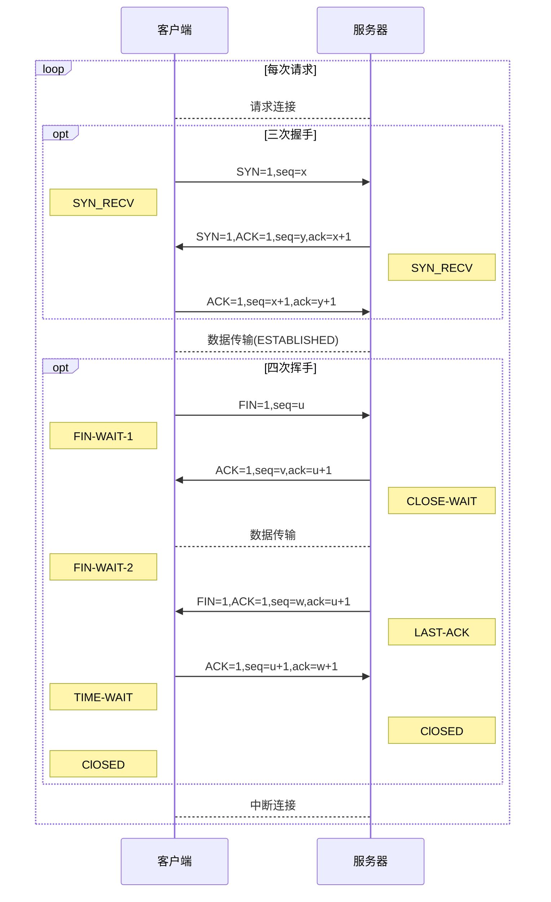
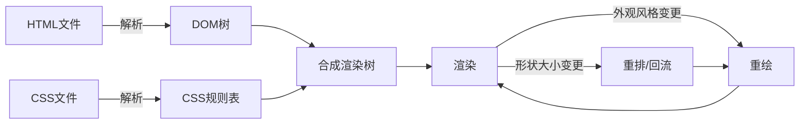

<!--
 * @version: 1.0.0
 * @Date: 2019-09-25 19:39:01
 * @LastEditTime: 2019-09-25 20:51:33
 -->
# 浏览器

##### 1.浏览器解析

##### 2. 建立TCP连接([TCP连接三次握手四次挥手](https://blog.csdn.net/qq_38950316/article/details/81087809))

字段|含义
---|:--:
URG|紧急指针是否有效。为1，表示某一位需要被优先处理
ACK|确认号是否有效，一般置为1。
PSH|提示接收端应用程序立即从TCP缓冲区把数据读走。
RST|对方要求重新建立连接，复位。
SYN|请求建立连接，并在其序列号的字段进行序列号的初始值设定。建立连接，设置为1
FIN|希望断开连接
seq|报文段中的第一个字节的数据编号
ack|期待收到对方下一个报文段的第一个数据字节的序号

##### 3. 缓存资源加载：

分类：Service Workers、Memory Cache 内存缓存(强缓存)、Disk Cache 磁盘缓存(强缓存)、Push Cache。

##### 5. 浏览器渲染：

##### 备注([状态码](https://help.aliyun.com/knowledge_detail/36393.html?spm=5176.13394938.0.0.5f4f2813vEprwy))